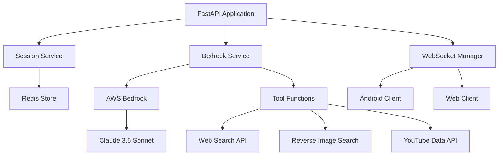

# Checkmate Backend - AI Fact-Checking API

[](https://fastapi.tiangolo.com/)
[](https://www.python.org/downloads/)
[](https://aws.amazon.com/bedrock/)
[](https://redis.io/)

High-performance FastAPI backend powering real-time AI fact-checking with AWS Bedrock Claude 3.5 Sonnet integration, comprehensive tool functions, and scalable session management.

## 🏗️ Architecture



## 📋 Prerequisites

### System Requirements
- **Python 3.11+**
- **Redis Server 7.0+**
- **4GB+ RAM** (recommended)
- **2+ CPU cores** (recommended)

### API Services
- **AWS Account** with Bedrock access
- **Google Custom Search Engine** ID
- **Google API Key** (for CSE and YouTube)
- **YouTube Data API v3** access

### Python Dependencies
See `requirements.txt` for complete list of dependencies.

## 🚀 Installation & Setup

### 1. Environment Setup

```bash
# Clone the repository
git clone https://github.com/DanielWang0099/Checkmate.git
cd Checkmate/backend

# Create virtual environment
python -m venv checkmate-env
source checkmate-env/bin/activate  # On Windows: checkmate-env\Scripts\activate

# Install dependencies
pip install -r requirements.txt
```

### 2. Configuration

Create `.env` file in the backend directory:

```env
# AWS Configuration
AWS_ACCESS_KEY_ID=your_aws_access_key_id
AWS_SECRET_ACCESS_KEY=your_aws_secret_access_key
AWS_REGION=us-east-1

# Bedrock Configuration
BEDROCK_MODEL_ID=anthropic.claude-3-5-sonnet-20241022-v2:0
BEDROCK_MAX_TOKENS=4096
BEDROCK_TEMPERATURE=0.1

# Google APIs
GOOGLE_CSE_ID=your_google_custom_search_engine_id
GOOGLE_API_KEY=your_google_api_key
YOUTUBE_API_KEY=your_youtube_data_api_key

# Redis Configuration
REDIS_URL=redis://localhost:6379
REDIS_PASSWORD=optional_redis_password
REDIS_DB=0

# Application Settings
DEBUG=false
LOG_LEVEL=INFO
HOST=0.0.0.0
PORT=8000
CORS_ORIGINS=http://localhost:3000,http://127.0.0.1:3000

# Session Configuration
SESSION_TIMEOUT=3600
MAX_CONCURRENT_SESSIONS=100
CLEANUP_INTERVAL=300
```

### 3. AWS Bedrock Setup

1. **Enable Bedrock Access**:
   ```bash
   aws bedrock list-foundation-models --region us-east-1
   ```

2. **Request Claude 3.5 Sonnet Access**:
   - Go to AWS Bedrock Console
   - Navigate to "Model access"
   - Request access to "Claude 3.5 Sonnet v2"
   - Wait for approval (usually instant)

3. **Verify Access**:
   ```bash
   python -c "
   import boto3
   client = boto3.client('bedrock-runtime', region_name='us-east-1')
   print('Bedrock access verified!')
   "
   ```

### 4. Google APIs Setup

#### Custom Search Engine
1. Go to [Google Custom Search](https://cse.google.com/)
2. Create a new search engine
3. Set search the entire web
4. Get your CSE ID from Control Panel

#### YouTube Data API
1. Go to [Google Cloud Console](https://console.cloud.google.com/)
2. Enable YouTube Data API v3
3. Create credentials (API Key)
4. Restrict key to YouTube Data API

### 5. Redis Setup

#### Local Installation
```bash
# Ubuntu/Debian
sudo apt update
sudo apt install redis-server

# macOS
brew install redis

# Windows
# Download from https://redis.io/download
```

#### Docker Alternative
```bash
docker run -d \
  --name checkmate-redis \
  -p 6379:6379 \
  redis:7-alpine
```

#### Verify Redis
```bash
redis-cli ping
# Should return: PONG
```

## 🎯 Running the Application

### Development Mode
```bash
# Start Redis (if not running)
redis-server

# Run the application
python -m uvicorn app.main:app --reload --host 0.0.0.0 --port 8000

# Access API documentation
# http://localhost:8000/docs
```

### Production Mode
```bash
# Install production dependencies
pip install gunicorn uvloop httptools

# Run with Gunicorn
gunicorn app.main:app \
  -w 4 \
  -k uvicorn.workers.UvicornWorker \
  --bind 0.0.0.0:8000 \
  --access-logfile - \
  --error-logfile -
```

### Docker Deployment
```bash
# Build image
docker build -t checkmate-backend .

# Run container
docker run -d \
  --name checkmate-backend \
  -p 8000:8000 \
  --env-file .env \
  checkmate-backend
```

### Docker Compose
```yaml
version: '3.8'
services:
  backend:
    build: .
    ports:
      - "8000:8000"
    env_file:
      - .env
    depends_on:
      - redis
    restart: unless-stopped

  redis:
    image: redis:7-alpine
    ports:
      - "6379:6379"
    volumes:
      - redis_data:/data
    restart: unless-stopped

volumes:
  redis_data:
```

## 🔧 Configuration Details

### AWS Configuration
```python
# app/core/config.py
class AWSConfig:
    access_key_id: str
    secret_access_key: str
    region: str = "us-east-1"
    bedrock_model_id: str = "anthropic.claude-3-5-sonnet-20241022-v2:0"
```

### Agent Configuration
```python
# Agent system prompts and configurations
MANAGER_AGENT_PROMPT = """
You are a fact-checking manager agent...
"""

TEXT_AGENT_PROMPT = """
You are a specialized text fact-checking agent...
"""
```

### Tool Functions
- **Web Search**: Google Custom Search integration
- **Image Search**: Reverse image lookup
- **YouTube Search**: Video content analysis
- **URL Validation**: Link verification

## 📊 API Endpoints

### WebSocket Endpoints
- `ws://localhost:8000/ws/{session_id}` - Real-time fact-checking

### HTTP Endpoints
- `GET /health` - Health check
- `POST /sessions` - Create new session
- `GET /sessions/{session_id}` - Get session info
- `DELETE /sessions/{session_id}` - End session
- `GET /docs` - API documentation

### WebSocket Message Format
```json
{
  "type": "fact_check_request",
  "content": {
    "text": "Claim to fact-check",
    "image_url": "optional_image_url",
    "source_app": "app_package_name",
    "content_type": "TEXT|IMAGE|VIDEO|NEWS",
    "capture_type": "MANUAL|AUTOMATIC|SCHEDULED"
  }
}
```

### Response Format
```json
{
  "type": "fact_check_response",
  "session_id": "session_uuid",
  "content": {
    "overall_verdict": "TRUE|FALSE|MIXED|UNVERIFIED",
    "confidence_score": 0.85,
    "summary": "Brief fact-check summary",
    "evidence": [
      {
        "source": "source_url",
        "excerpt": "relevant_text",
        "supports": true
      }
    ],
    "links": ["url1", "url2"]
  }
}
```

## 🧪 Testing

### Unit Tests
```bash
# Run all tests
pytest tests/ -v

# Run specific test file
pytest tests/test_bedrock_service.py -v

# Run with coverage
pytest tests/ --cov=app --cov-report=html
```

### Integration Tests
```bash
# Test tool functions
python -m app.test_tools

# Test WebSocket connection
python tests/test_websocket.py
```

### Load Testing
```bash
# Install locust
pip install locust

# Run load tests
locust -f tests/load_test.py --host=http://localhost:8000
```

## 📈 Monitoring & Logging

### Logging Configuration
```python
# app/core/config.py
LOGGING_CONFIG = {
    "version": 1,
    "disable_existing_loggers": False,
    "formatters": {
        "default": {
            "format": "%(asctime)s - %(name)s - %(levelname)s - %(message)s",
        },
    },
    "handlers": {
        "console": {
            "class": "logging.StreamHandler",
            "formatter": "default",
        },
        "file": {
            "class": "logging.FileHandler",
            "filename": "checkmate.log",
            "formatter": "default",
        },
    },
    "root": {
        "level": "INFO",
        "handlers": ["console", "file"],
    },
}
```

### Health Monitoring
```bash
# Check application health
curl http://localhost:8000/health

# Check Redis connection
curl http://localhost:8000/health/redis

# Check AWS Bedrock access
curl http://localhost:8000/health/bedrock
```

## 🚀 Performance Optimization

### Redis Optimization
```bash
# Configure Redis for production
echo "maxmemory 2gb" >> /etc/redis/redis.conf
echo "maxmemory-policy allkeys-lru" >> /etc/redis/redis.conf
```

### FastAPI Optimization
```python
# app/main.py
app = FastAPI(
    title="Checkmate API",
    version="1.0.0",
    docs_url="/docs",
    redoc_url="/redoc",
    openapi_url="/openapi.json"
)

# Enable compression
app.add_middleware(GZipMiddleware, minimum_size=1000)
```

### AWS Bedrock Optimization
- Use appropriate model parameters
- Implement request batching
- Cache frequent responses
- Monitor token usage

## 🔒 Security

### Environment Variables
Never commit `.env` files to version control.

### API Security
```python
# app/core/security.py
from fastapi.security import HTTPBearer
from fastapi import HTTPException, Depends

security = HTTPBearer()

async def verify_token(token: str = Depends(security)):
    # Implement JWT verification
    pass
```

### CORS Configuration
```python
app.add_middleware(
    CORSMiddleware,
    allow_origins=["http://localhost:3000"],
    allow_credentials=True,
    allow_methods=["*"],
    allow_headers=["*"],
)
```

## 🐛 Troubleshooting

### Common Issues

#### AWS Connection Issues
```bash
# Check AWS credentials
aws sts get-caller-identity

# Check Bedrock access
aws bedrock list-foundation-models --region us-east-1
```

#### Redis Connection Issues
```bash
# Check Redis status
redis-cli ping

# Check Redis logs
tail -f /var/log/redis/redis-server.log
```

#### Import Errors
```bash
# Reinstall dependencies
pip install --force-reinstall -r requirements.txt

# Check Python version
python --version  # Should be 3.11+
```

### Performance Issues
- Monitor CPU and memory usage
- Check Redis memory consumption
- Review AWS Bedrock quotas
- Optimize agent prompts

## 📚 API Documentation

### Interactive Documentation
- **Swagger UI**: http://localhost:8000/docs
- **ReDoc**: http://localhost:8000/redoc

### WebSocket Testing
```javascript
// Test WebSocket connection
const ws = new WebSocket('ws://localhost:8000/ws/test-session');
ws.onopen = () => {
    ws.send(JSON.stringify({
        type: 'fact_check_request',
        content: {
            text: 'The Earth is flat',
            content_type: 'TEXT',
            capture_type: 'MANUAL'
        }
    }));
};
```

## 🤝 Contributing

1. Follow PEP 8 style guidelines
2. Add type hints to all functions
3. Write comprehensive tests
4. Update documentation
5. Add appropriate logging

## 📄 License

This project is licensed under the MIT License.

---

**Need help?** Check the [main README](../README.md) or open an issue on GitHub.
