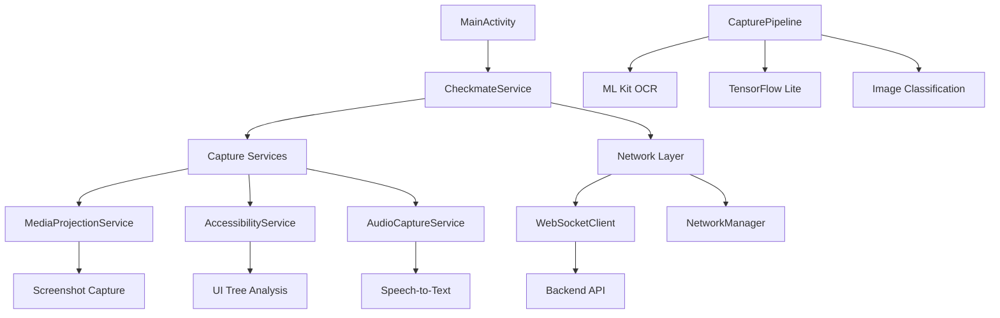

# Checkmate Android - Real-Time Fact-Checking Client

[](https://developer.android.com/about/versions/nougat)
[](https://kotlinlang.org/)
[](https://developer.android.com/jetpack/compose)
[](https://developers.google.com/ml-kit)

Advanced Android application providing real-time AI-powered fact-checking with comprehensive input capture, background processing, and intelligent session management.

## 🏗️ Architecture



## 📋 Prerequisites

### Development Environment
- **Android Studio Arctic Fox** or later
- **Android SDK API 24+** (Android 7.0+)
- **Java 11+**
- **Kotlin 1.9+**
- **Gradle 8.0+**

### Device Requirements
- **Android 7.0+** (API 24+)
- **2GB+ RAM** (recommended)
- **Internet connection** for real-time fact-checking
- **Microphone access** for audio capture
- **Storage access** for ML models

### Permissions Required
- `SYSTEM_ALERT_WINDOW` - Overlay notifications
- `BIND_ACCESSIBILITY_SERVICE` - UI monitoring
- `RECORD_AUDIO` - Audio capture
- `INTERNET` - Network communication
- `FOREGROUND_SERVICE` - Background processing
- `WAKE_LOCK` - Keep service active
- `CAMERA` - Future image capture features

## 🚀 Installation & Setup

### 1. Clone & Build

```bash
# Clone the repository
git clone https://github.com/DanielWang0099/Checkmate.git
cd Checkmate/frontend

# Build debug APK
./gradlew assembleDebug

# Install on connected device
adb install app/build/outputs/apk/debug/app-debug.apk
```

### 2. Android Studio Setup

1. **Open Project**: Open `frontend` directory in Android Studio
2. **Sync Gradle**: Let Gradle sync dependencies
3. **Configure SDK**: Ensure Android SDK 34+ is installed
4. **Build Project**: Build → Make Project

### 3. Configuration

#### Backend Connection
Edit `app/src/main/java/com/checkmate/app/data/AppConfig.kt`:

```kotlin
object AppConfig {
    // Backend configuration
    const val BASE_URL = "http://10.0.2.2:8000"  // For emulator
    // const val BASE_URL = "http://192.168.1.100:8000"  // For real device
    
    const val WEBSOCKET_URL = "ws://10.0.2.2:8000/ws"
    
    // Session settings
    const val DEFAULT_SESSION_DURATION = 60 // minutes
    const val AUTO_CAPTURE_INTERVAL = 30 // seconds
    const val MAX_RETRY_ATTEMPTS = 3
}
```

#### ML Models Setup
```bash
# Create models directory
mkdir -p app/src/main/assets/models

# Add your MobileNetV2 model (optional - fallback included)
# cp your_model.tflite app/src/main/assets/models/mobilenet_screenshot_classifier.tflite
```

## 🔧 Build Configuration

### Gradle Configuration

Key dependencies in `app/build.gradle.kts`:

```kotlin
dependencies {
    // Core Android
    implementation("androidx.core:core-ktx:1.12.0")
    implementation("androidx.lifecycle:lifecycle-runtime-ktx:2.7.0")
    implementation("androidx.activity:activity-compose:1.8.2")
    
    // Jetpack Compose
    implementation(platform("androidx.compose:compose-bom:2023.10.01"))
    implementation("androidx.compose.ui:ui")
    implementation("androidx.compose.material3:material3")
    
    // Services & Background Processing
    implementation("androidx.lifecycle:lifecycle-service:2.7.0")
    implementation("androidx.work:work-runtime-ktx:2.8.1")
    
    // ML & Computer Vision
    implementation("com.google.mlkit:text-recognition:16.0.0")
    implementation("org.tensorflow:tensorflow-lite:2.13.0")
    implementation("org.tensorflow:tensorflow-lite-support:0.4.4")
    
    // Networking
    implementation("com.squareup.retrofit2:retrofit:2.9.0")
    implementation("com.squareup.okhttp3:okhttp:4.12.0")
    implementation("org.java-websocket:Java-WebSocket:1.5.4")
    
    // JSON & Data
    implementation("com.google.code.gson:gson:2.10.1")
    implementation("androidx.datastore:datastore-preferences:1.0.0")
    
    // Coroutines
    implementation("org.jetbrains.kotlinx:kotlinx-coroutines-android:1.7.3")
    
    // Logging
    implementation("com.jakewharton.timber:timber:5.0.1")
}
```

### ProGuard Configuration

For release builds, add to `proguard-rules.pro`:

```proguard
# Keep ML Kit classes
-keep class com.google.mlkit.** { *; }

# Keep TensorFlow Lite classes
-keep class org.tensorflow.lite.** { *; }

# Keep WebSocket classes
-keep class org.java_websocket.** { *; }

# Keep model classes
-keep class com.checkmate.app.data.** { *; }
```

## 🏃 Running the Application

### Development Build
```bash
# Build and install debug version
./gradlew installDebug

# Run on connected device
./gradlew connectedDebugAndroidTest
```

### Release Build
```bash
# Generate signed APK
./gradlew assembleRelease

# APK location: app/build/outputs/apk/release/
```

### Testing
```bash
# Unit tests
./gradlew test

# Integration tests
./gradlew connectedAndroidTest

# Lint checks
./gradlew lint
```

## 🔧 Core Components

### Services Architecture

#### CheckmateService (Main Service)
```kotlin
class CheckmateService : LifecycleService() {
    // Primary foreground service
    // Coordinates all other services
    // Manages session lifecycle
    // Handles WebSocket communication
}
```

#### MediaProjectionService 
```kotlin
class MediaProjectionService : Service() {
    // Captures screenshots using MediaProjection API
    // Real-time bitmap processing
    // Efficient memory management
}
```

#### AudioCaptureService
```kotlin
class AudioCaptureService : Service() {
    // Continuous audio monitoring
    // Google Speech-to-Text integration
    // Delta transcription processing
}
```

#### CheckmateAccessibilityService
```kotlin
class CheckmateAccessibilityService : AccessibilityService() {
    // UI tree monitoring
    // App context detection
    // Content change triggers
}
```

### Capture Pipeline

#### CapturePipeline Class
```kotlin
class CapturePipeline(private val context: Context) {
    suspend fun captureFrame(): FrameBundle? {
        // Coordinates all input capture
        // OCR text extraction
        // Image classification
        // Audio processing
        // Returns unified data bundle
    }
}
```

#### ML Components
- **TextExtractor**: ML Kit OCR integration
- **ImageClassifier**: TensorFlow Lite image analysis
- **AudioProcessor**: Speech-to-text conversion

### Network Layer

#### WebSocketClient
```kotlin
class WebSocketClient : WebSocketListener {
    // Real-time communication with backend
    // Automatic reconnection logic
    // Message queue management
}
```

#### NetworkManager
```kotlin
class NetworkManager(private val context: Context) {
    // Connection state management
    // Retry logic implementation
    // Error handling
}
```

## 📱 User Interface

### MainActivity (Jetpack Compose)
```kotlin
@Composable
fun CheckmateApp() {
    // Modern Material 3 design
    // Permission request flows
    // Service control interface
    // Settings management
}
```

### Quick Settings Tile
```kotlin
class CheckmateTileService : TileService() {
    // Quick access from notification panel
    // Toggle fact-checking on/off
    // Visual service status
}
```

## 🔒 Permissions & Security

### Required Permissions

#### Critical Permissions
```xml
<!-- Overlay for notifications -->
<uses-permission android:name="android.permission.SYSTEM_ALERT_WINDOW" />

<!-- Accessibility service -->
<uses-permission android:name="android.permission.BIND_ACCESSIBILITY_SERVICE" />

<!-- Audio capture -->
<uses-permission android:name="android.permission.RECORD_AUDIO" />

<!-- Foreground service -->
<uses-permission android:name="android.permission.FOREGROUND_SERVICE" />
```

#### Optional Permissions
```xml
<!-- Camera for future features -->
<uses-permission android:name="android.permission.CAMERA" />

<!-- Storage for ML models -->
<uses-permission android:name="android.permission.READ_EXTERNAL_STORAGE" />
```

### Permission Handling
```kotlin
class PermissionHelper {
    fun requestAllPermissions(activity: Activity) {
        // Systematic permission request flow
        // User-friendly explanations
        // Graceful degradation
    }
}
```

## 🧪 Testing

### Unit Tests
```bash
# Run all unit tests
./gradlew test

# Test specific components
./gradlew testDebugUnitTest --tests="*CapturePipelineTest*"
```

### Integration Tests
```bash
# Device-connected tests
./gradlew connectedAndroidTest

# Service communication tests
./gradlew connectedDebugAndroidTest --tests="*ServiceTest*"
```

### Manual Testing Checklist
- [ ] Service starts and stops correctly
- [ ] Permissions are granted properly
- [ ] WebSocket connection establishes
- [ ] Screenshot capture works
- [ ] Audio capture functions
- [ ] Accessibility service responds
- [ ] ML models load successfully
- [ ] Notifications display correctly

## 📊 Performance Monitoring

### Battery Optimization
```kotlin
// Intelligent capture timing
private fun shouldCapture(): Boolean {
    val batteryLevel = getBatteryLevel()
    val isCharging = isDeviceCharging()
    
    return when {
        batteryLevel < 20 && !isCharging -> false
        isCharging -> true
        else -> batteryLevel > 30
    }
}
```

### Memory Management
```kotlin
// Efficient bitmap handling
private fun processBitmap(bitmap: Bitmap) {
    try {
        // Process bitmap
    } finally {
        bitmap.recycle() // Always recycle
    }
}
```

### Performance Metrics
- **Service overhead**: ~150MB RAM
- **Battery impact**: <2% additional drain
- **CPU usage**: <5% during active capture
- **Network usage**: ~10MB/hour

## 🚀 Deployment

### Debug Deployment
```bash
# Connect device via ADB
adb devices

# Install debug APK
./gradlew installDebug

# View logs
adb logcat -s Checkmate
```

### Release Deployment
```bash
# Generate signed APK
./gradlew assembleRelease

# Install release APK
adb install app/build/outputs/apk/release/app-release.apk
```

### Play Store Preparation
1. **Signing**: Configure app signing
2. **Optimization**: Enable APK optimization
3. **Testing**: Run full test suite
4. **Metadata**: Prepare store listing

## 🐛 Troubleshooting

### Common Issues

#### Build Failures
```bash
# Clean and rebuild
./gradlew clean
./gradlew build

# Check Gradle version
./gradlew --version

# Update dependencies
./gradlew dependencyUpdates
```

#### Runtime Issues
```bash
# Check device logs
adb logcat -s Checkmate

# Check service status
adb shell dumpsys activity services com.checkmate.app

# Monitor memory usage
adb shell dumpsys meminfo com.checkmate.app
```

#### Permission Issues
- Verify all permissions granted in Settings
- Check accessibility service is enabled
- Ensure overlay permission is granted
- Verify microphone access

#### Network Issues
- Check backend URL configuration
- Verify device internet connection
- Test WebSocket connection manually
- Check firewall settings

### Debug Tools
```kotlin
// Enable debug logging
if (BuildConfig.DEBUG) {
    Timber.plant(Timber.DebugTree())
}

// Network debugging
if (BuildConfig.DEBUG) {
    val interceptor = HttpLoggingInterceptor()
    interceptor.setLevel(HttpLoggingInterceptor.Level.BODY)
    okHttpClient.addInterceptor(interceptor)
}
```

## 🔧 Development Tips

### Code Organization
```
app/src/main/java/com/checkmate/app/
├── data/           # Data models and DTOs
├── services/       # Background services
├── utils/          # Utility classes
├── managers/       # State management
├── network/        # Network layer
├── ml/            # Machine learning components
└── ui/            # User interface (Compose)
```

### Best Practices
- Use dependency injection (Hilt recommended)
- Implement proper error handling
- Add comprehensive logging
- Follow Material Design guidelines
- Optimize for battery life
- Handle network connectivity changes

### Debugging Services
```kotlin
// Service debugging
class CheckmateService : LifecycleService() {
    override fun onCreate() {
        super.onCreate()
        if (BuildConfig.DEBUG) {
            startForeground(NOTIFICATION_ID, createDebugNotification())
        }
    }
}
```

## 📚 Additional Resources

### Documentation
- [Android Services Guide](https://developer.android.com/guide/components/services)
- [ML Kit Documentation](https://developers.google.com/ml-kit)
- [TensorFlow Lite Android](https://www.tensorflow.org/lite/guide/android)
- [Jetpack Compose](https://developer.android.com/jetpack/compose)

### Sample Code
- WebSocket implementation examples
- ML Kit integration samples
- Accessibility service tutorials
- MediaProjection API usage

## 🤝 Contributing

1. Follow Android coding conventions
2. Use Kotlin coroutines for async operations
3. Write comprehensive tests
4. Add proper documentation
5. Optimize for performance and battery life

## 📄 License

This project is licensed under the MIT License.

---

**Need help?** Check the [main README](../README.md) or [backend documentation](../backend/README.md).
